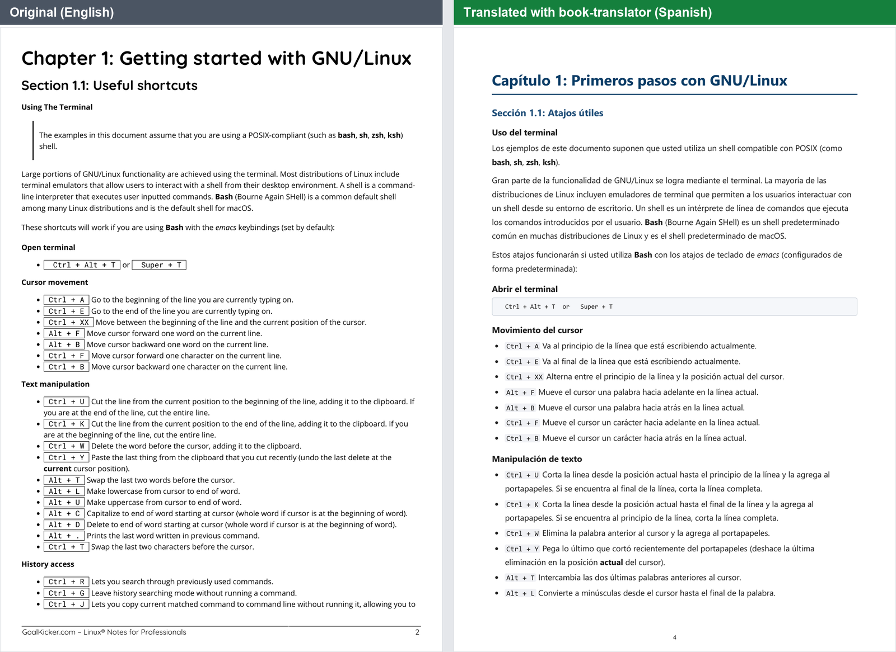
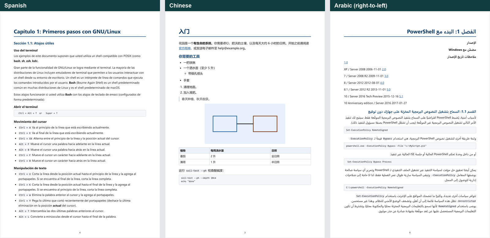
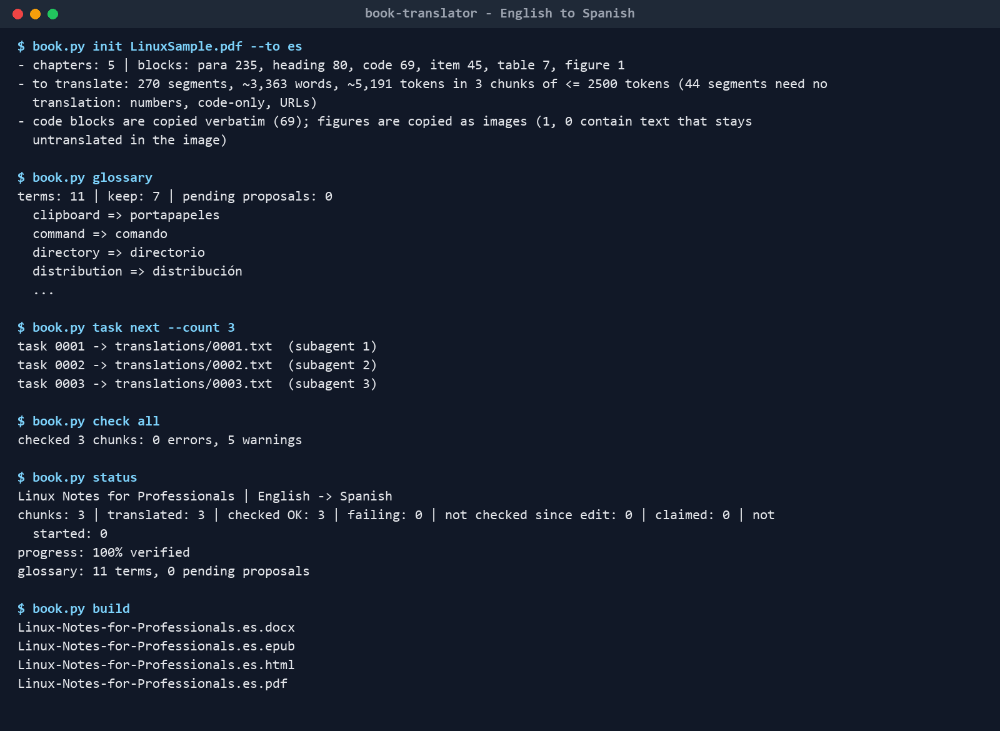

# Book Translator

[](https://github.com/asadeisa/book-translator/actions/workflows/tests.yml)

[](LICENSE)

An agent skill for translating a **whole book**, from any language into any
other, without losing a sentence and without overflowing the agent's context
window.

Ask an AI agent to translate a 300-page book and it fails without telling you.
The book doesn't fit in context, so the agent works from memory in big pieces.
Sentences drop out of long paragraphs, inline code and URLs disappear, one term
is rendered three different ways, tables are flattened into prose, and captions
get invented for images nobody looked at. The result reads fluently, so nobody
notices.

This skill turns the book into numbered segments and hands the agent one small,
self-contained task at a time. It checks every result against the source
mechanically, and only then rebuilds the book. All state lives on disk, so the
work survives context resets and can be split across parallel subagents.



## How it works

```
book.pdf ──extract──► segments ──plan──► chunks of ~2,500 tokens
                                             │
          glossary (decided first) ──────────┤
                                             ▼
                    task file ──► translator (agent or subagents) ──► translation file
                                             │
                               check: missing / lost code, URLs, numbers / untranslated
                                             │
                               review: side-by-side fidelity sheets
                                             ▼
                         build ──► PDF · EPUB · DOCX · HTML · Markdown
```

1. **Extract.** PDF (text layer), EPUB, DOCX, HTML, Markdown or TXT becomes
   chapters of blocks: headings, paragraphs, lists, tables, quotes, code and
   figures. The extractor drops running headers, footers and page numbers,
   and recognises tables with or without borders, drawn bullets, and code
   boxes.
2. **Exclude** what is not content: the printed table of contents, credits,
   ads. The extraction report suggests these.
3. **Glossary first.** `terms` lists the recurring vocabulary. Each term gets
   one translation before chunk 1, so a domain word keeps its domain meaning.
4. **Translate chunk by chunk.** Each task file holds everything a translator
   needs: rules, style, the glossary entries that occur in it, the previous
   chunk's last lines, nearby code as context, and the segments. Code blocks
   never pass through the translator.
5. **Check** every chunk: missing or misplaced segments, lost inline code,
   URLs, e-mails, link targets or keep-terms, text left in the source language,
   dropped sentences, missing numbers, length outliers, and glossary misses.
6. **Review** with side-by-side sheets and a fidelity rubric, by a fresh
   reviewer agent.
7. **Build** the translated book. The PDF is printed through Edge or Chrome,
   so every script is shaped correctly, and it has a table of contents with
   page numbers and bookmarks.



## Install

Copy this folder into your agent's skills folder, for example
`~/.claude/skills/book-translator/` for Claude Code, and install the
dependencies:

```bash
pip install pymupdf python-docx pillow
python scripts/book.py doctor
```

PDF output needs Microsoft Edge or Google Chrome (found automatically, or set
`BOOK_BROWSER`). `pip install playwright` is optional and adds page-number
footers. HTML, EPUB, DOCX and Markdown need no browser.

Then ask your agent: *"Translate book.pdf into Spanish, PDF and EPUB."* It
follows [SKILL.md](SKILL.md).

## Commands



| Command | What it does |
|---|---|
| `init BOOK --to LANG` | Extract, detect the source language, plan chunks, print the report |
| `show c004 --blocks 0-40` | Print what was extracted from a chapter, to compare with the original |
| `exclude c002 c076` | Leave chapters out |
| `set style=... formats=pdf,epub` | Project settings (style, notes, numerals, formats, title, translator) |
| `terms` / `glossary --add "term=translation"` | Find and fix the vocabulary |
| `task next [--count 4]` | Write the next task file(s), one per translator |
| `check N` / `check all` | Verify translations against the source |
| `status` | Progress and what to do next |
| `review all` | Side-by-side review sheets |
| `build [--formats pdf,epub,docx,html,md]` | Assemble the translated book |
| `preview` | Render PDF pages to PNG for a visual check |
| `doctor` | Check dependencies |

Run `python scripts/book.py <command> -h` for options. Re-extracting after
translation has started is safe: `init --force` moves finished translations to
the new segments by matching their source text.

## Faithfulness rules

- Every segment is translated once and in order. Nothing is summarised,
  merged, split or reordered.
- Code, URLs, identifiers and numbers are not translated, and the checker
  verifies it.
- Nothing is invented: no captions for unseen images, and translator's notes
  only when enabled, as separate blocks.
- The author's mistakes are translated as written.
- One term, one translation, enforced by the glossary.

These rules come from auditing a real AI translation of a 184-page technical
book. The translation itself was about 99% faithful. The errors were in what the
translator *added*: invented captions, wrong "modernisation" notes, and domain
terms taken in their everyday sense.

## Languages and formats

Any language pair works. Right-to-left scripts (Arabic, Hebrew, Persian, Urdu)
get mirrored layout in HTML, PDF, EPUB and DOCX. CJK, Indic and Thai scripts
are shaped by the browser. Writing direction, script detection and font
stacks per language live in [`scripts/langs.py`](scripts/langs.py); adding a
language is one line. Details: [references/output.md](references/output.md).

## Limitations

- Scanned PDFs need OCR first (for example `ocrmypdf`).
- The book is re-typeset, not reproduced page by page.
- Text inside images stays as it is.
- Code comments stay in the source language, because code blocks are copied
  byte for byte.
- PDF extraction is heuristic. Check it with `show` before translating; very
  complex layouts may need `--columns 2` or exclusions
  ([references/extraction.md](references/extraction.md)).
- Translation quality is the model's. The skill prevents omissions and drift
  and makes review systematic.

## Tests

```bash
pip install pytest pymupdf python-docx pillow
pytest tests
```

The tests build every input format from scratch, run the checker against a
translation with a lost link, re-extract a book mid-translation, and build
every output format. The PDF test runs when a browser is available. CI runs
them on Python 3.10, 3.12 and 3.14.

## License

MIT, see [LICENSE](LICENSE). By [asad](https://github.com/asadeisa).
